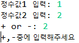

# 연산자2

### 비교연산자 \(Comparison\)

비교연산자는 관계연산자이자 이항연산자입니다.

비교연산자의 특징은 다음과 같습니다.

1. 두 값을 비교하는 연산자
2. 비교값이 참이면`true`, 거짓이면 `false`
3. 즉 비교연산을 한 결과값은 논리값

다음과 같은 종류가 있습니다.

* `a < b` : a가 b보다 작은가?
* `a > b` : a가 b보다 큰가?
* `a <= b` : a가 b보다 작거나 같은가?
* `a >= b` : a가 b보다 크거나 같은가?
* `a == b` : a와 b가 일치하는가?
* `a != b` : a와 b가 다른가?

예제를 통해 살펴보겠습니다. 새로운 클래스에 매소드를 만들어 주세요.

```java
public void method1() {
		int a = 10;
		int b = 25;
		
		System.out.print(a == b);   //false
		System.out.print(a <= b);   //true  
		System.out.print(a > b);    //false
		
		System.out.print(a != b);   //true
	}
```

이해가 잘 되시나요? 

비교 연산자의 경우에는 `boolean`자료형 변수에 담을수도 있습니다.

```java
boolean result = (a >= b);  //false
```

### 

### 산술연산 + 비교연산

a가 짝수인가를 물어보는 코드를 한번 작성해보세요

```java
System.out.print(a % 2 == 0);    //true
```

1. 우선순위에 의해 산술연산을 먼저 진행한다.
2. a 를 2로 나눈 나머지 값이 0인지 비교연산한다.

### 

### 논리연산자

논리연산자는 이항연산자입니다.

 즉, 두가지 논리값을 가지고 연산하는 연산자입니다.

```java
논리값 && 논리값  
//and 두 논리값 모두 true => true

논리값 || 논리값  
//or  두 논리값중 하나라도 true =>true
```

일단 사용자의 입력값이 정수값 1이상 100이하인지 확인하는 코드를 만들어 보겠습니다.

```java
public void E_Logical() {
		Scanner sc = new Scanner(System.in);
	
		System.out.print("값 입력:");
		int num = sc.nextInt();
	}
```

```java
System.out.print(1 <= num <= 100);//Error
```

어떻게 구현할 수 있을까요? 이런경우 논리연산자를 사용하면 가능합니다.

```java
System.out.print( num >= 1 && num <= 100 );   //and
```

`&&`연산자를 사용하면 두가지 조건이 모두 `true`여야

 결과값이 `true`가 출력됩니다. 

즉 num이 1이상_**이고\(이면서\)**_ 100이하 라고 읽어보면 이해하기 쉽죠?

그렇다면 이번에는 입력값이 대문자인지 확인해보겠습니다.

```java
System.out.print("영문자 하나 입력");
char ch = sc.nextLine().charAt(0);
```

대문자를 어떻게 찾는지를 알아보자면 

* 컴퓨터는 문자를 고유한 숫자로 인식합니다.
* AZ의 값은 65~90까지의 숫자로 나열되어있습니다.
* 즉 && 연산자를 사용해 비교연산자를 사용하면 되겠죠?

```java
System.out.print("영문자 하나 입력");
char ch = sc.nextLine().charAt(0);

System.out.println(ch >= 'A' && ch <= 'Z');
                // ch >=  65 && ch <=  90
```

이해가 되시나요?

이제 `||` 연산자에 대하여 알아보도록 하겠습니다.

그렇다면 사용자가 입력한 값이 소문자y, 대문자Y인지 확인하는 코드를 만들어 보겠습니다.

```java

System.out.print("종료하시려면 y또는 Y를 입력하세요: ");
char ch = sc.nextLine().charAt(0);
		
System.out.println(ch == 'y' || ch == 'Y');  
```

여기서는 y나 Y중 하나를 입력하면 true값이 출력됩니다.


정리해보겠습니다. 

> ####      `&&` : 두개의 조건이 모두 true 여야 결과값이 true이다.

> * true && true -&gt; true
> * true && false -&gt; false
> * false && true -&gt; false
> * false && false -&gt; false

> ####     `||` : 두개의 조건이 하나라도 true라면 결과값이 true이다.

> * true && true -&gt; true
> * true && false -&gt; true
> * false && true -&gt; true
> * false && false -&gt; false

혹시 감을 잡으셨나요? 

`&&`연산자는 앞의 내용이 `true`가 되면 뒤쪽 내용이 실행되지 않습니다.

`||`연산자는 앞의 내용이 `true`면 뒤쪽 내용이 실행되지 않습니다. 

이러한 원리는 조건문에서도 사용이 되는데 나중에 알아보도록 하겠습니다.

이와 관련한 코드를 작성해 보겠습니다. 

```java
int num1 = 10;
System.out.println("&& 연산전의 num값: "+ num1 );
		
boolean result1 = num1 <5 && ++num1 >0;   //false && true
		
System.out.println(num1);
```


### 삼항연산자

삼항 연산자는 항목이 3개인 연산자입니다.

```java
조건식? true일 경우의 결과값 : false일 경우의 결과값2
```

조건식은 반드시 true 또는 false가 나오게끔 작성해야 하며,

주로 조건식에는 비교/ 논리연산자가 사용됩니다.

사용자가 입력한 정수값이 양수인지 아닌지 판별하는 예제를 보겠습니다.

```java
public void method() {
		Scanner sc = new Scanner(System.in);
		System.out.print("정수값 입력: ");
		int num = sc.nextInt();
		                       //삼항연산자
		System.out.println(num > 0 ? "양수":"음수");
	}
}
```

위에 코드에서는 num이 0보다 크면 양수, 작으면 음수를 출력하는 예제입니다.

삼항연산자를 통해 조건별 변수를 설정할 수도 있습니다.

```java
String result = num % 2 !=1?"짝수이다":"홀수이다";
```

이번에는 사용자가 입력한 영문자 값이 대문자인지 아닌지 판별한 후 출력하는 코드를 작성해보겠습니다.

```java
public void method() {
		Scanner sc = new Scanner(System.in);
		
		System.out.print("영문자 하나 입력: ");
	  char ch = sc.nextLine().charAt(0);
	}
```

우선 위와 같은 매소드를 만들었습니다. 

위에서 언급한 것과 같이 문자의 Aski Code를 이용해 비교연산자로 계산을 해주는 조건문을 만들면 되겠죠?

```java
String result=
 (ch >= 'A' && ch <= 'Z') ?
"대문자다" :
"소문자다"
```


또한 삼항연산자 안에서 다시 삼항연산자를 사용할 수도 있습니다.

사용자가 입력한 정수값이 양수인지, 음수인지, 0인지 정확히 판별하는 코드를 작성해 보도록 하겠습니다.

```java
public void method() {
		Scanner sc = new Scanner(System.in);
		
		System.out.print("정수값 입력: ");
	     int num = sc.nextInt();
	     
	     String result= (num>0 ? "양수이다":(num==0 ? "0이다":"음수다"));
	    	 
	     System.out.print(result);
		
	}
```

이해가 잘 되시나요?

 이해를 돕기위해 \( \)를 사용했지만 사용하지 않으셔도 상관은 없습니다. 하지만 코드는 작성도 중요하지만 가독성도 중요하기 때문에  나눠서 작성해주시거나 \( \)를 붙여주시기를 추천드립니다.


이번에는 사용자에게 두개의 정수값을 입력받고,  +나 -를 입력받아 그에 해당하는 연산결과를 출력해보겠습니다.

```java
public void method() {
		Scanner sc = new Scanner(System.in);
		//사용자 입력
		 System.out.print("정수값1 입력: ");
	     int num1 = sc.nextInt();
	     
	     System.out.print("정수값2 입력: ");
	     int num2 = sc.nextInt();
	     
	     sc.nextLine();
	     System.out.print("+ or -: ");
	     char sign = sc.nextLine().charAt(0);
		
		// 삼항연산자
	     String result = (sign=='+' ? num1 + num2 :( sign!='-'?"+,-중에 입력해주세요":num1-num2));
	    //오류
	}
```

오류가 나오게 되죠? 이유는 Int를 String에 담을 수 없기 때문입니다.

해결방법은 숫자형을 문자열로 바꿔주면 되겠죠? 전에 문자열+숫자형= 문자열이 되는 것을 배웠습니다.

그걸 활용해서 해결해 보겠습니다.

```java
String result = 
(sign=='+' ? 
    
    num1 + num2 +"":
    
    ( sign!='-' ?     
        "+,-중에 입력해주세요":
        (num1-num2)+""));
```




### 

### 복합 산술 대입 연산자

산술연산자\(+-/\*%\)와 대입연산자를 한께 사용하는 연산자입니다.

연산 처리속도가 훨씬 빠르기 때문에 사용을 권장해요

#### 종류

#### +=   -=   \*=   /=   %=

```java
a= a+3;       >          a+=3

```

위와같은 방법으로 사용할 수 있습니다.

아래의 예제를 살펴보세요

```java
public void method3() {
		int num = 12;
		System.out.println("기존 num: " + num);
		
		num += 3;   //num = num + 3
		System.out.println("3증가시킨 num: " + num);
		
		num -= 5;   //num = num - 3
		System.out.println("다시 5감소시킨 num: " + num);
		
	}
```


편한방법을 사용하셔도 무방하지만, 복합산술연산자를 사용해주면 최적화에 더욱 용이하기 때문에 사용을 추천드립니다!

뿐만아니라 문자열의 경우에도 사용이 가능하답니다.

```java
String str = "Hello";
System.out.println("기존 str: "+ str);
		
str += "World";
System.out.print("더한 str: "+str);
```


이제 연산자파트는 끝났습니다. 연산자는 자바뿐만 아닌 여러가지 언어에서도 활용가능한 부분이니 꼭 숙지하도록하세요!

